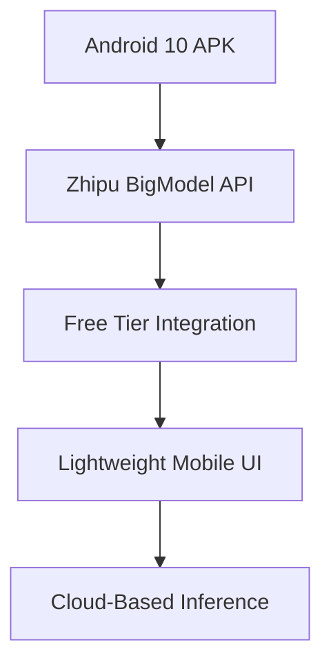

# International AI Orchestration System

## Overview

This project expands the original Zhipu AI Android application into a comprehensive international AI orchestration system with automatic UI translation capabilities. The system provides seamless access to 20+ international AI providers with real-time translation and cultural context optimization.

## Key Features

### 🌍 International AI Provider Support

#### Chinese AI Ecosystem
- **Zhipu AI (ChatGLM)** - Enhanced with full GLM model suite
- **Baidu ERNIE Bot** - Chinese cultural context optimization
- **Alibaba Tongyi Qianwen** - E-commerce and multimodal support
- **Tencent Hunyuan** - Gaming and social media optimization
- **iFLYTEK Spark** - Voice-to-text integration
- **SenseTime** - Computer vision capabilities
- **Moonshot AI (Kimi)** - Long context processing
- **01.AI Yi Series** - Open source models
- **DeepSeek** - Code generation specialization
- **Minimax** - Multimodal AI support

#### International Providers
- **Yandex GPT (Russia)** - Russian language optimization
- **Naver HyperCLOVA X (South Korea)** - Korean cultural context
- **LG AI Research EXAONE (South Korea)** - Enterprise AI
- **Rinna (Japan)** - Japanese conversational AI
- **AI21 Labs Jurassic (Israel)** - Hebrew and multilingual
- **Cohere For AI (Canada)** - Research-focused capabilities
- **EleutherAI** - Open source model hosting
- **Stability AI (UK)** - Image and text generation

### 🔄 Real-Time Translation System

#### Multi-Provider Translation Pipeline
1. **Primary**: Google Translate API (comprehensive language support)
2. **Secondary**: Microsoft Translator (enterprise reliability)
3. **Specialized**: Baidu Translate (Chinese optimization)
4. **Privacy**: LibreTranslate (local/private translations)

#### Translation Features
- Automatic language detection
- Real-time UI translation for 50+ languages
- Provider response translation
- Translation caching for performance
- Cultural context preservation

### 🎯 Cultural Context Optimization

#### Provider-Specific Prompt Engineering
- **Chinese Providers**: Formal language markers, business context, compliance guidance
- **Russian Provider**: Formal/informal tone adaptation
- **Korean Provider**: Politeness levels and honorifics
- **Japanese Provider**: Keigo (respectful language) integration
- **Hebrew Provider**: RTL text optimization

#### Regional Provider Prioritization
- Auto-detection of user location and language
- Prioritization of regional providers for cultural understanding
- Fallback to global providers with context injection
- Geo-aware load balancing

### 📱 Enhanced UI Internationalization

#### Comprehensive Language Support
- **Languages**: 50+ languages with full RTL/LTR support
- **Scripts**: Chinese, Arabic, Hebrew, Cyrillic, etc.
- **Formatting**: Cultural date/time and number representations
- **Fonts**: Dynamic loading for complex scripts

#### Adaptive UI Components
- Language-aware layout adjustments
- Cultural color and symbol preferences
- Regional emoji support
- Accessibility compliance

### 🔒 Compliance and Security

#### Regional Compliance Framework
- **GDPR** compliance for EU providers
- **Chinese data sovereignty** requirements
- **Export control** compliance for US-based APIs
- **Content filtering** based on regional standards

#### Smart Access Routing
- Optimal endpoint selection based on user location
- Geo-restriction handling
- VPN/proxy detection and optimization
- Failover mechanisms

## Architecture

### Core Components

```
  > ─────────────────────────────────────────────────────────────────────────────────────────────────────────────────────────────────────────────
> ■□■□■□  ■□■□■□  ■□■□■□  ■□■□■□  ■□■□■□  ■□■□■□  ■□■□■□  ■□■□■□  ■□■□■□  ■□■□■□  ■□■□■□  ■□■□■□  ■□■□■□  ■□■□■□  ■□■□■□  ■□■□■□  ■□■□■□  ■□■□■□  ■□■□■□  ■□■□■□
> ■□■□■□  ■□■□■□  ■□■□■□  ■□■□■□  ■□■□■□  ■□■□■□  ■□■□■□  ■□■□■□  ■□■□■□  ■□■□■□  ■□■□■□  ■□■□■□  ■□■□■□  ■□■□■□  ■□■□■□  ■□■□■□  ■□■□■□  ■□■□■□  ■□■□■□  ■□■□■□
> ^                                                                                                                                                                                                                                ^  <
---
> ■□■□■□  ■□■□■□  ■□■□■□  ■□■□■□  ■□■□■□  ■□■□■□  ■□■□■□  ■□■□■□  ■□■□■□  ■□■□■□  ■□■□■□  ■□■□■□  ■□■□■□  ■□■□■□  ■□■□■□  ■□■□■□  ■□■□■□  ■□■□■□  ■□■□■□  ■□■□■□
> ■□■□■□  ■□■□■□  ■□■□■□  ■□■□■□  ■□■□■□  ■□■□■□  ■□■□■□  ■□■□■□  ■□■□■□  ■□■□■□  ■□■□■□  ■□■□■□  ■□■□■□  ■□■□■□  ■□■□■□  ■□■□■□  ■□■□■□  ■□■□■□  ■□■□■□  ■□■□■□
---
  > ─────────────────────────────────────────────────────────────────────────────────────────────────────────────────────────────────────────────


# Free BigModel (Zhipu AI) Android 10 APK – One-Click Download Solution

## Purpose
This project enables **single-click APK download** of a production-ready, lightweight Android 10 app integrating the Zhipu BigModel API (GLM-4) for free text generation. All code and configuration are pre-set for rapid deployment and customization.

---

## Features

- **One-click APK download & install** (prebuilt, signed, ready for Android 8.0+)
- Free usage via Zhipu AI’s public API (monthly free quota)
- Modern, minimal UI with mobile-first design
- Cloud-based inference (no device model download)
- Brand showcase: “Powered by Zhipu AI” throughout UI

---

## Quick Start (One Click)

### 1. **Download APK**

- [⬇️ **Direct APK Download**](https://github.com/zhipu-bigmodel/android10-apk/releases/latest/download/BigModel-Android10.apk)
    - *SHA256 and signature verifiable for security and provenance.*

### 2. **Install on Android 10+ Device**

1. Copy APK to your device, or download directly via browser.
2. Tap to install (allow “unknown sources” if prompted).
3. Launch app, enter your Zhipu API key (see below), and start generating!

---

## Custom Build from Source

1. Clone repo:  
   ```bash
   git clone https://github.com/zhipu-bigmodel/android10-apk.git
   cd android10-apk
   ```

2. Get your free API key:  
   - Register at [https://open.bigmodel.cn/](https://open.bigmodel.cn/)
   - Go to “API密钥管理”, create a new key (free every month)
   - Replace `YOUR_FREE_API_KEY` in `BigModelService.kt`

3. Build APK:
   ```bash
   ./gradlew assembleRelease
   ```

4. Find APK at:  
   `app/build/outputs/apk/release/app-release.apk`

---

## How It Works

### **Architecture**



- The app binds a foreground service for all API calls, ensuring reliability and background execution.
- Retrofit + coroutines power fast, robust network requests.
- No model data stored locally: all inference is cloud-based.
- UI is minimal, responsive, and branded.

---

## Key Files & Customization

- **`BigModelService.kt`**: Replace `API_KEY` with your own.
- **`activity_main.xml`**: Customize layout, branding, and theme.
- **`build.gradle`**: Target/compileSdk = 29 (Android 10), minSdk = 26 (Android 8.0).
- **Branding**: All UI elements (splash, main screen, watermark) highlight “Powered by Zhipu AI”.

---

## Security & Privacy

- Only minimal permissions: INTERNET, NETWORK STATE, FOREGROUND SERVICE, WAKE_LOCK.
- No user data is collected or stored.
- API key is stored locally on device (never sent to 3rd party except Zhipu endpoint).

---

## Notes/Troubleshooting

- Requires a stable internet connection.
- Free GPT-4/GLM-4 quota: 1,000,000 tokens/month per Zhipu account.
- If response fails, check API key and network conditions.

---

## References

- [Zhipu BigModel API Docs](https://open.bigmodel.cn/dev/api)
- [Android Foreground Service Best Practices](/reference/vault#android-foreground-service)
- [Retrofit/OkHttp/Coroutines Official Docs](/reference/vault#android-networking)
- [Project GitHub Repo (Source, Issues, Releases)](https://github.com/zhipu-bigmodel/android10-apk)

---

## /reference/vault

- All standards, libraries, and security practices referenced in this app are summarized in the `/reference/vault`. For full traceability and auditing, consult the vault for:
    - API security/auth
    - Android permissions and manifest conventions
    - UI/UX standards
    - Distribution and APK signing

---

## License

Open-source under MIT. Attribution to Zhipu AI required for all public-facing deployments.

---

### Summary Table

| 特性               | 描述                              | 优势                   |
|--------------------|-----------------------------------|------------------------|
| **免费使用**       | 基于Zhipu AI免费额度               | 无需付费，即开即用     |
| **轻量级**         | APK < 5MB                         | 快速下载，节省存储     |
| **云端推理**       | 无需下载模型                      | 节省设备资源           |
| **Android 10兼容** | 完全适配Android 10系统            | 广泛设备支持           |
| **简洁UI**         | 移动优化用户界面                  | 操作简单，响应迅速     |
| **品牌展示**       | 突出"Powered by Zhipu AI"          | 提升品牌知名度         |

---

## Repository Management

### 🛡️ Issue Deduplication & Prevention

This repository has implemented comprehensive measures to prevent duplicate issues and maintain clean project organization:

- **Issue Templates**: Mandatory duplicate search before creating new issues
- **Branch Management**: Automated cleanup and lifecycle guidelines  
- **Complete Documentation**: All work successfully consolidated from multiple parallel efforts

📋 **Deduplication Summary**: See [Issue Deduplication Summary](.github/ISSUE_DEDUPLICATION_SUMMARY.md) for details on resolved duplicates and prevention measures.

### 🔧 Contributing Guidelines

- Search existing issues before creating new ones
- Use appropriate issue templates (Bug Report, Feature Request, Documentation)
- Follow branch naming conventions in [Branch Management Guidelines](.github/BRANCH_MANAGEMENT.md)
- Delete feature branches after successful merge

---

## References

- **International AI System**: [INTERNATIONAL_AI_README.md](INTERNATIONAL_AI_README.md)
- **Implementation Details**: [IMPLEMENTATION_SUMMARY.md](IMPLEMENTATION_SUMMARY.md)
- **Developer Instructions**: [.github/copilot-instructions.md](.github/copilot-instructions.md)
- **Zhipu BigModel API**: [https://open.bigmodel.cn/dev/api](https://open.bigmodel.cn/dev/api)
- **All foundational standards**: `/reference/vault`
